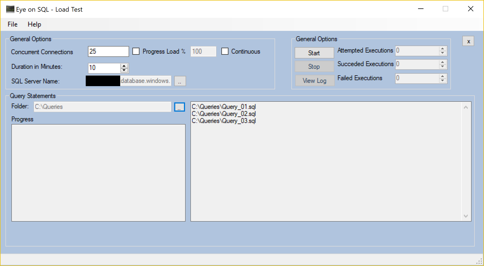
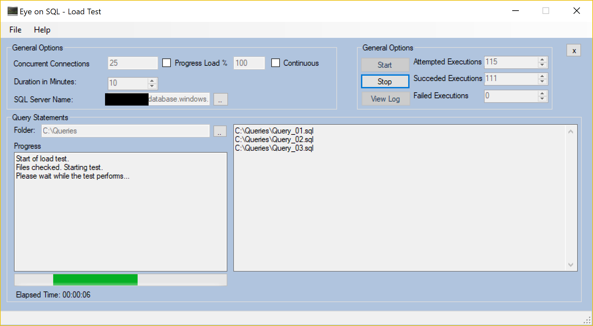
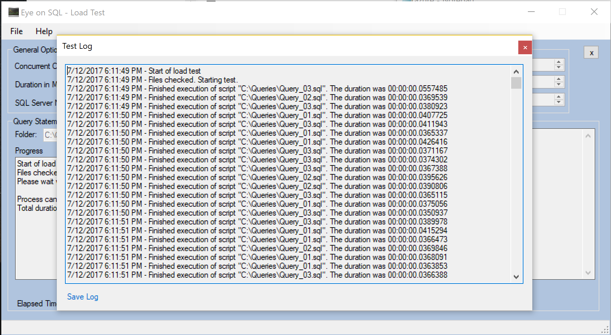

# EyeOnSql
SQL Server Stress Test tool

Project Description: Eye on SQL - Load Test is a tool designed for volume tests against SQL Server.

Once started, you can start a new test where you can define the amount of concurrent connections, if the load is all at once or by increments, the duration and if the test is Continous (in which case the previous settings defaults to predefined values)

This tool allows only the selection of folders containing .sql files to run (future versions will be more flexible). When more than one file resides on the selected folder, each execution will randomly choose one of the files

Next, start the test and look for its progress. The test can be stopped at any point or let it finish based on the defined duration (if test is set to continous, then manual stop is the only way to stop it).

Finally you can view the log for the execution, where you'll find the script executed, its duration and relevant information of the test:

Coming soon

Currently an option for checking the metric of some counters is being developed. Also general improvements in performance and visuals.

Finally

This tool was designed as a simple load test agent against a SQL server. The idea of it is to stress a database and server with some predefined queries.

This tool is still under development, so it still has some bugs and some improvements needed. I'm working on several aspects of it, but of course I'm open to comments and to nice-to-have things. Also, if you think this application deserves a donation, I'll be glad to accept one. If you can support this, please use the Donate button on the following link (Personal Blog): http://alepelc.wordpress.com

Alejandro Pelc

https://www.linkedin.com/in/alejandropelc

http://alepelc.wordpress.com
